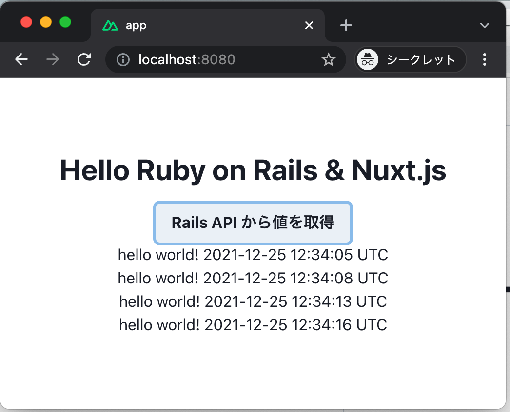

# sample app




# memo

```
docker-compose up
```


## api

```
docker-compose build

docker-compose run --rm api rails new . -f -B -d mysql --api

docker-compose run --rm api rails db:create

docker-compose up api
```


## front

```
docker-compose run --rm front yarn create nuxt-app
# -> ERROR
# Could not create project in app because the directory is not empty.
 
docker-compose run --rm front yarn create nuxt-app app
mv front/app/{*,.*} front
rmdir front/app
docker-compose up front
```
